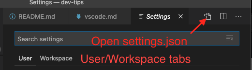

# How To Configure Visual Studio Code for Cantera

This file will have an opinionated take on setting up Visual Studio Code (VS Code or vscode) for Cantera development. Feel free to take or leave any of these tips as you wish, what works for me may not for you.

## Settings

VS Code has two places it can store settings:

1. A global directory specific to your operating system, called "User Configuration" in VS Code
2. Within your local working directory, in a folder called `.vscode`, called "Workspace Configuration" in VS Code

In both places, settings are stored in a JSON file so you can edit them manually if you want, or you can use the point-and-click interface. You can open the settings window by typing `CTRL+,` (Windows, Linux) or `COMMAND+,` (macOS). You'll see the User and Workspace settings tabs right below the search box. You can open the JSON settings file by clicking the "Open File" button in the top right of the window. I'm going to show the JSON settings here, but you can usually find the same setting in the GUI interface by searching the name inside the string.



Settings defined in your local configuration always override the global configuration. Most of the settings I end up configuring are related to an Extension, so I'll describe those below. The settings I always change that come by default with VS Code are:

```json
{
    "files.insertFinalNewline": true,
    "files.trimFinalNewlines": true,
    "editor.renderWhitespace": "boundary",
    "files.trimTrailingWhitespace": true,
    "editor.formatOnSave": true
}
```

I typically change these in the User configuration so it applies to all of my projects. These five settings make sure that:

1. A file always ends with a newline character
2. A file always ends with a single newline character
3. Whitespace (spaces, tabs) are rendered when they are not between words, for instance at the beginning or ending of a line
4. Trailing whitespace is removed from each line
5. This automatic formatting is applied every time I save the file

VS Code also allows you to specify language-specific settings by putting the name of the language as the mapping key inside square brackets. When VS Code detects a particular language is used for a file, it applies the settings in that block. I typically set the following settings for Markdown and YAML files:

```json
{
    "[markdown]": {
        "editor.tabSize": 2,
        "files.trimTrailingWhitespace": false
    },
    "[yaml]": {
        "editor.tabSize": 2,
    }
}
```

For Markdown settings, I set the tab size to 2 spaces (spaces are default), since 2 spaces is typically the standard for Markdown. Then, I turn off trimming trailing whitespace on lines for Markdown, since 2 spaces at the end of a line results in an HTML `</br>` character. Thus, trimming out that whitespace would hamper my ability to write Markdown.

For YAML settings, I just set the tab size to 2 spaces.

## Extensions

I currently use the following extensions for Cantera work:

- C/C++ (Microsoft)
- Cython (Thomas Walther)
- GitHub Pull Requests and Issues (GitHub)
- GitLens (Eric Amodio)
- Matlab (Xavier Hahn)
- Python (Microsoft)
- Visual Studio IntelliCode (Microsoft)

I'll talk a little more about some of them below.

### GitHub Pull Requests and Issues

This extension makes it much easier to do code reviews on big pull requests from within VS Code, rather than trying to work in the browser.

### GitLens

GitLens allows you to see the commit history for a line in a file from within VS Code. Super useful when you want to start yelling at the terrible developer who last touched this line, because you don't have to go to your browser to find out it was yourself.

### Python

The Python extension is really excellent because it includes the ability to run linters and formatters on Python code as you write it. Unfortunately, it's not super helpful for Cantera development because we write most code in Cython. This is most useful for working on examples.

Nonetheless, I use Python for a lot of other development, so I have a global configuration for Python that looks like this:

```json
{
    "python.formatting.provider": "black",
    "python.formatting.blackPath": "${env:HOME}/.local/bin/black",
    "python.linting.mypyPath": "${env:HOME}/.local/bin/mypy",
    "python.linting.flake8Path": "${env:HOME}/.local/bin/flake8",
    "python.linting.flake8Enabled": true,
    "python.linting.mypyEnabled": true,
    "python.dataScience.enabled": false
}
```

These settings set up formatting and linting for Python code that I like to use. In more recent versions of the Python extension, they added a "feature" where when you push `Shift+Enter`, a Jupyter Notebook opens up. This annoys me because I accidentally type that combination all the time (say, ending a line with a double quote), so the last setting line disables that feature.

Then, in my workspace settings for Cantera, I put:

```json
{
    "editor.formatOnSave": false
}
```

Without that setting, `black` will try to format your Python files, but we don't use Black's style guide for Cantera.

## Other General Tips/Keyboard Shortcuts

- We don't want to add the `.vscode` folder to Cantera's general `.gitignore`, because not everyone will use it. However, you can still get git to ignore that folder by editing the file `.git/info/exclude`. The `.git` folder won't show up in VS Code, so you'll have to use another text editor (`nano` or `vim` on the command line, for example) to edit the file. The syntax in that file is the same as in `.gitignore`, so you can do:

  ```console
  nano .git/info/exclude
  ```

  and add

  ```text
  .vscode/
  ```

  to have git ignore the folder.

- You can use `F12` (you might need to press `Fn` for your keyboard to actually send `F12`) to jump to the definition of the function or class under your cursor. Really, really useful in C++ land where everything seems like it's a virtual function defined on the parent class.
- You can press `CTRL+k` (Windows, Linux) or `COMMAND+k` (macOS) and then `s` to save a file without auto-formatting it, if you have format-on-save enabled by default.
- You can press `CTRL+G` (macOS, yes that means Control not Command, not sure about the other OS) to jump to a specific line in the open file.
- `CTRL+SHIFT+T` (Windows, Linux) and `COMMAND+SHIFT+T` (macOS) reopens a tab you just closed. This works in Chrome and Firefox too.
